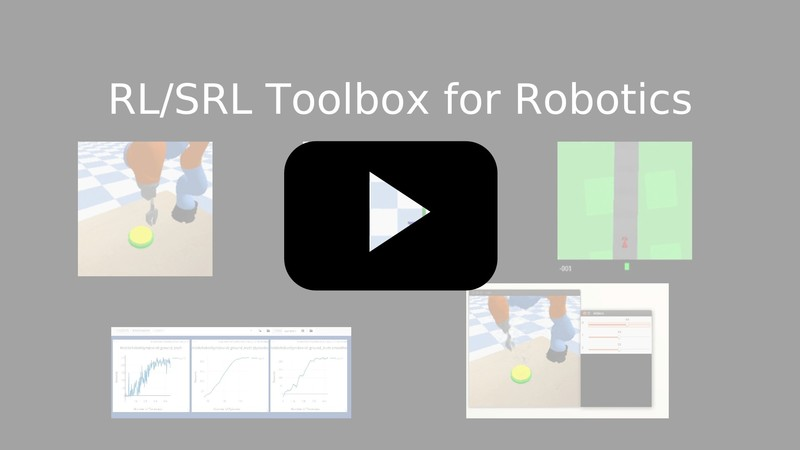
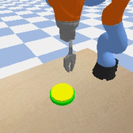
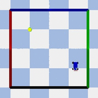
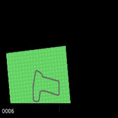

# Reinforcement Learning (RL) and State Representation Learning (SRL) Toolbox for Robotics

This repository was made to evaluate State Representation Learning methods using Reinforcement Learning. It integrates (automatic logging, plotting, saving, loading of trained agent) various RL algorithms (PPO, A2C, ARS, DDPG, DQN, ACER, CMA-ES, SAC) along with different SRL methods (see [SRL Repo](https://github.com/araffin/srl-zoo)) in an efficient way (1 Million steps in 1 Hour with 8-core cpu and 1 Titan X GPU).

We also release customizable Gym environments for working with simulation (Kuka arm, Mobile Robot in PyBullet, running at 250 FPS on a 8-core machine) and real robots (Baxter Robot, Robobo with ROS).

<a href="https://drive.google.com/open?id=153oxiwHyK2W9nU3avEi0b0O4qjo7WD0X"></a>


Table of Contents
=================
* [Installation](#installation)
  * [Using Anaconda](#using-anaconda)
  * [Using Docker](#using-docker)
    * [Use Built Images](#use-built-images)
    * [Build the Docker Images](#build-the-docker-images)
    * [Run the images](#run-the-images)
* [Reinforcement Learning](#reinforcement-learning)
  * [RL Algorithms: OpenAI Baselines and More](#rl-algorithms-openai-baselines-and-more)
    * [Train an Agent with Discrete Actions](#train-an-agent-with-discrete-actions)
    * [Train an Agent with Continuous Actions](#train-an-agent-with-continuous-actions)
    * [Train an agent multiple times on multiple environments, using different methods](#train-an-agent-multiple-times-on-multiple-environments-using-different-methods)
    * [Load a Trained Agent](#load-a-trained-agent)
    * [Add Your own RL Algorithm](#add-your-own-rl-algorithm)
  * [Hyperparameter Search](#hyperparameter-search)
* [Environments](#environments)
  * [Available Environments](#available-environments)
  * [Generating Data](#generating-data)
* [State Representation Learning Models](#state-representation-learning-models)
  * [Plot Learning Curve](#plot-learning-curve)
* [Working With Real Robots: Baxter and Robobo](#working-with-real-robots-baxter-and-robobo)
* [Troubleshooting](#troubleshooting)
* [Known issues](#known-issues)


## Installation

Note **Python 3 is required** (python 2 is not supported because of OpenAI baselines)


### Using Anaconda

0. Download the project (note the `--recursive` argument because we are using git submodules):
```
git clone git@github.com:araffin/robotics-rl-srl.git --recursive
```

1. Install the swig library:
```
sudo apt-get install swig
```

2. Install the dependencies using `environment.yml` file (for anaconda users) in the current environment
```
conda env create --file environment.yml
source activate py35
```

3. Download and install [Stable Baselines](https://github.com/hill-a/stable-baselines.git) (a fork of OpenAI Baselines). Make sure you have the right dependencies (see the README in the stable baselines repo)
```
git clone https://github.com/hill-a/stable-baselines.git
cd stable-baselines/
# Hack for now, until the refactoring is over
git checkout 1f8a03f3a62367526f
pip install -e .
```

Note: The save method of ACER of baselines is currently buggy, you need to manually add an import (see [pull request #312](https://github.com/openai/baselines/pull/312))

[PyBullet Documentation](https://docs.google.com/document/d/10sXEhzFRSnvFcl3XxNGhnD4N2SedqwdAvK3dsihxVUA)

### Using Docker

#### Use Built Images

GPU image (requires [nvidia-docker](https://github.com/NVIDIA/nvidia-docker)):
```
docker pull araffin/rl-toolbox
```

CPU only:
```
docker pull araffin/rl-toolbox-cpu
```

#### Build the Docker Images

Build GPU image (with nvidia-docker):
```
docker build . -f docker/Dockerfile.gpu -t rl-toolbox
```

Build CPU image:
```
docker build . -f docker/Dockerfile.cpu -t rl-toolbox-cpu
```

Note: if you are using a proxy, you need to pass extra params during build and do some [tweaks](https://stackoverflow.com/questions/23111631/cannot-download-docker-images-behind-a-proxy):
```
--network=host --build-arg HTTP_PROXY=http://your.proxy.fr:8080/ --build-arg http_proxy=http://your.proxy.fr:8080/ --build-arg HTTPS_PROXY=https://your.proxy.fr:8080/ --build-arg https_proxy=https://your.proxy.fr:8080/
```

#### Run the images

Run the nvidia-docker GPU image
```
docker run -it --runtime=nvidia --rm --network host --ipc=host --name test --mount src="$(pwd)",target=/tmp/rl_toolbox,type=bind araffin/rl-toolbox bash -c 'source activate py35 && cd /tmp/rl_toolbox/ && python -m rl_baselines.train --srl-model ground_truth --env MobileRobotGymEnv-v0 --no-vis --num-timesteps 1000'
```

Or, with the shell file:
```
./run_docker_gpu.sh python -m rl_baselines.train --srl-model ground_truth --env MobileRobotGymEnv-v0 --no-vis --num-timesteps 1000
```

Run the docker CPU image
```
docker run -it --rm --network host --ipc=host --name test --mount src="$(pwd)",target=/tmp/rl_toolbox,type=bind araffin/rl-toolbox-cpu bash -c 'source activate py35 && cd /tmp/rl_toolbox/ && python -m rl_baselines.train --srl-model ground_truth --env MobileRobotGymEnv-v0 --no-vis --num-timesteps 1000'
```

Or, with the shell file:
```
./run_docker_cpu.sh python -m rl_baselines.train --srl-model ground_truth --env MobileRobotGymEnv-v0 --no-vis --num-timesteps 1000
```


Explanation of the docker command:
 - `docker run -it` create an instance of an image (=container), and run it interactively (so ctrl+c will work)
 - `--rm` option means to remove the container once it exits/stops (otherwise, you will have to use `docker rm`)
 - `--network host` don't use network isolation, this allow to use visdom on host machine
 - `--ipc=host` Use the host system’s IPC namespace. It is needed to train SRL model with PyTorch. IPC (POSIX/SysV IPC) namespace provides separation of named shared memory segments, semaphores and message queues.
 - `--name test` give explicitely the name `test` to the container, otherwise it will be assigned a random name
 - `--mount src=...` give access of the local directory (`pwd` command) to the container (it will be map to `/tmp/rl_toolbox`), so all the logs created in the container in this folder will be kept (for that you need to pass the `--log-dir logs/` option)
 - `bash -c 'source activate py35 && ...` Activate the conda enviroment inside the docker container, and launch an experiment (` python -m rl_baselines.train ...`)


## Reinforcement Learning

Note: All CNN policies normalize input, dividing it by 255.
By default, observations are not stacked.
For SRL, states are normalized using a running mean/std average.

About frame-stacking, action repeat (frameskipping) please read this blog post: [Frame Skipping and Pre-Processing for DQN on Atari](https://danieltakeshi.github.io/2016/11/25/frame-skipping-and-preprocessing-for-deep-q-networks-on-atari-2600-games/)

Before you start a RL experiment, you have to make sure that a visdom server is running, unless you deactivate visualization.

Launch visdom server:
```
python -m visdom.server
```

### RL Algorithms: OpenAI Baselines and More

Several algorithms from [Open AI baselines](https://github.com/openai/baselines) have been integrated along with some evolution strategies and SAC:

- DQN and variants (Double, Dueling, prioritized experience replay)
- ACER: Sample Efficient Actor-Critic with Experience Replay
- A2C: A synchronous, deterministic variant of Asynchronous Advantage Actor Critic (A3C) which gives equal performance.
- PPO2: Proximal Policy Optimization (GPU Implementation)
- DDPG: Deep Deterministic Policy Gradients
- ARS: Augmented Random Search
- CMA-ES: Covariance Matrix Adaptation Evolution Strategy
- SAC: Soft Actor Critic

#### Train an Agent with Discrete Actions

To train an agent (without visualization with visdom):
```
python -m rl_baselines.train --algo ppo2 --log-dir logs/ --no-vis
```

You can train an agent on the latest learned model (knowing it's type) located at `log_folder: srl_zoo/logs/DatasetName/` (defined for each environment in `config/srl_models.yaml`) :
```
python -m rl_baselines.train --algo ppo2 --log-dir logs/ --latest --srl-model srl_combination --env MobileRobotGymEnv-v0
```

#### Train an Agent with Continuous Actions

Continuous actions have been implemented for DDPG, PPO2, ARS, CMA-ES, SAC and random agent.
To use continuous actions in the position space:
```
python -m rl_baselines.train --algo ppo2 --log-dir logs/ -c
```

To use continuous actions in the joint space:
```
python -m rl_baselines.train --algo ppo2 --log-dir logs/ -c -joints
```

#### Train an agent multiple times on multiple environments, using different methods

To run multiple enviroments with multiple SRL models for a given algorithm (you can use the same arguments as for training should you need to specify anything to the training script):
```
python  -m rl_baselines.pipeline --algo ppo2 --log-dir logs/ --env env1 env2 [...] --srl-model model1 model2 [...]
```

For example, run a total of 30 experiments of ppo2 with 4 cpus and randomly initialized target position, in the default environment using VAE, and using ground truth (15 experiments each):
```
python  -m rl_baselines.pipeline --algo ppo2 --log-dir logs/ --srl-model vae ground_truth --random-target --num-cpu 4 --num-iteration 15
```

#### Load a Trained Agent


To load a trained agent and see the result:
```
python -m replay.enjoy_baselines --log-dir path/to/trained/agent/ --render
```

#### Add Your own RL Algorithm

If you want to integrate your own RL algorithm, please read `rl_baselines/README.md`.

### Hyperparameter Search

This repository also allows hyperparameter search, using [hyperband](https://arxiv.org/abs/1603.06560) or [hyperopt](https://papers.nips.cc/paper/4443-algorithms-for-hyper-parameter-optimization.pdf) for the implemented RL algorithms

for example, here is the command for a hyperband search on PPO2, ground truth on the mobile robot environment:
```bash
python -m rl_baselines.hyperparam_search --optimizer hyperband --algo ppo2 --env MobileRobotGymEnv-v0 --srl-model ground_truth
```

## Environments

All the environments we propose follow the OpenAI Gym interface. We also extended this interface (adding extra methods) to work with SRL methods (see [State Representation Learning Models](#state-representation-learning-models)).

### Available Environments

| **Kuka environment**       | **Mobile Robot environment**       | **Racing car environment**       |
| -------------------------- | ---------------------------------- | -------------------------------- |
|  |  |  |


| **Name**                          | **Action space (discrete)**                | **Action space (continuous)**                 | **Rewards**                                                                                                                                             | **ground truth**                                  |
| --------------------------------- | ------------------------------------------ | --------------------------------------------- | ------------------------------------------------------------------------------------------------------------------------------------------------------- | ------------------------------------------------- |
| **Kuka**<br>**Button**            | 6 actions (3D cardinal direction)          | 3 axis (3D cardinal direction) <sup>(1)</sup> | 1 when target reached, -1 when too far from target or when table is hit, otherwise 0 <sup>(2)</sup> <sup>(3)</sup>                                                    | the X,Y,Z position of the effector <sup>(4)</sup> |
| **Kuka**<br>**RandButton**        | 6 actions (3D cardinal direction)          | 3 axis (3D cardinal direction) <sup>(1)</sup> | 1 when target reached, -1 when too far from target or when table is hit, otherwise 0 <sup>(2)</sup> <sup>(3)</sup>                                                    | the X,Y,Z position of the effector <sup>(4)</sup> |
| **Kuka**<br>**2Button**           | 6 actions (3D cardinal direction)          | 3 axis (3D cardinal direction) <sup>(1)</sup> | 1 when the first target is reached, 1 when the second target is reached, -1 when too far from target or when table is hit, otherwise 0 <sup>(2)</sup> | the X,Y,Z position of the effector <sup>(4)</sup> |
| **Kuka**<br>**MovingButton**      | 6 actions (3D cardinal direction)          | 3 axis (3D cardinal direction) <sup>(1)</sup> | 1 when target reached, -1 when too far from target or when table is hit, otherwise 0 <sup>(2)</sup> <sup>(3)</sup>                                                    | the X,Y,Z position of the effector <sup>(4)</sup> |
| **MobileRobot**<br>               | 4 actions (2D cardinal direction)          | 2 axis (2D cardinal direction)                | 1 when target reached, -1 for a wall hit, otherwise 0 <sup>(2)</sup>                                                                                    | the X,Y position of the robot <sup>(4)</sup>      |
| **MobileRobot**<br>**2Target**    | 4 actions (2D cardinal direction)          | 2 axis (2D cardinal direction)                | 1 when target reached, -1 for a wall hit, otherwise 0 <sup>(2)</sup>                                                                                    | the X,Y position of the robot <sup>(4)</sup>      |
| **MobileRobot**<br>**1D**         | 2 actions (1D cardinal direction)          | 1 axis (1D cardinal direction)                | 1 when target reached, -1 for a wall hit, otherwise 0 <sup>(2)</sup>                                                                                    | the X position of the robot <sup>(4)</sup>        |
| **MobileRobot**<br>**LineTarget** | 4 actions (2D cardinal direction)          | 2 axis (2D cardinal direction)                | 1 when target reached, -1 for a wall hit, otherwise 0 <sup>(2)</sup>                                                                                    | the X,Y position of the robot <sup>(4)</sup>      |
| **CarRacing**                     | 4 actions (left, right, accelerate, brake) | 3 axis (stearing, accelerate, brake)          | -100 when out of bounds, otherwise -0.1                                                                                                                 | the X,Y position of the car <sup>(4)</sup>        |

<sub><sup>1. The action space can use 6 axis arm joints control with the `--joints` flag</sup></sub><br>
<sup><sup>2. The reward can be the euclidian distance to the target with the `--shape-reward` flag</sup></sup><br>
<sup><sup>3. When using `--shape-reward` and ```--continuous```, the reward for hitting the button is 50 and for being out of bounds is -250. This is to prevent the agent hitting the table to stop the environment early and obtaining a higher reward</sup></sup><br>
<sup><sup>4. The ground truth can be relative position from agent to the target by changing the `RELATIVE_POS` constant in the environemnt file</sup></sup>

If you want to add your own environment, please read `enviroments/README.md`.

the available environments are:
- Kuka arm: Here we have a Kuka arm which must reach a target, here a button.
    - KukaButtonGymEnv-v0: Kuka arm with a single button in front.
    - KukaRandButtonGymEnv-v0: Kuka arm with a single button in front, and some randomly positioned objects
    - Kuka2ButtonGymEnv-v0: Kuka arm with 2 buttons next to each others, they must be pressed in the correct order (lighter button, then darker button).
    - KukaMovingButtonGymEnv-v0: Kuka arm with a single button in front, slowly moving left to right.
- Mobile robot: Here we have a mobile robot which reach a target position
    - MobileRobotGymEnv-v0: A mobile robot on a 2d terrain where it needs to reach a target position.
    - MobileRobot2TargetGymEnv-v0: A mobile robot on a 2d terrain where it needs to reach two target positions, in the correct order (lighter target, then darker target).
    - MobileRobot1DGymEnv-v0: A mobile robot on a 1d slider where it can only go up and down, it must reach a target position.
    - MobileRobotLineTargetGymEnv-v0: A mobile robot on a 2d terrain where it needs to reach a colored band going across the terrain.
- Racing car: Here we have the interface for the Gym racing car environment. It must complete a racing course in the least time possible (only available in a terminal with X running)
    - CarRacingGymEnv-v0: A racing car on a racing course, it must complete the racing course in the least time possible.
- Baxter: A baxter robot that must reach a target, with its arms. (see [Working With Real Robots: Baxter and Robobo](#working-with-real-robots-baxter-and-robobo))
    - Baxter-v0: A bridge to use a baxter robot with ROS (in simulation, it uses Gazebo)
- Robobo: A Robobo robot that must reach a target position.
    - RoboboGymEnv-v0: A bridge to use a Robobo robot with ROS.

### Generating Data

To test the environment with random actions:
```
python -m environments.dataset_generator --no-record-data --display
```
Can be as well used to render views (or dataset) with two cameras if `multi_view=True`.

To **record data** (i.e. generate a dataset) from the environment for **training a SRL model**, using random actions:
```bash
python -m environments.dataset_generator --num-cpu 4 --name folder_name
```


## State Representation Learning Models

Please look the [SRL Repo](https://github.com/araffin/srl-zoo) to learn how to train a state representation model.
Then you must edit `config/srl_models.yaml` and set the right path to use the learned state representations.

To train the Reinforcement learning baselines on a specific SRL model:
```
python -m rl_baselines.train --algo ppo2 --log-dir logs/ --srl-model model_name
```

The available state representation models are:
- ground_truth: the arm's x,y,z position
- robotic_priors: Robotic Priors model
- supervised: a supervised model from the raw pixels to the arm's x,y,z position
- pca: pca applied to the raw pixels
- autoencoder: an autoencoder from the raw pixels
- vae: a variational autoencoder from the raw pixels
- inverse: an inverse dynamics model
- forward: a forward dynamics model
- srl_combination: a model combining several losses (e.g. vae + forward + inverse...) for SRL
- multi_view_srl: a SRL model using views from multiple cameras as input, with any of the above losses (e.g triplet and others)
- joints: the arm's joints angles
- joints_position: the arm's x,y,z position and joints angles


Note: for debugging, we integrated logging of states (we save the states that the RL agent encountered during training) with SAC algorithm. To log the states during RL training you have to pass the `--log-states` argument:
```
python -m rl_baselines.train --srl-model ground_truth --env MobileRobotLineTargetGymEnv-v0 --log-dir logs/ --algo sac --reward-scale 10 --log-states

```
The states will be saved in a `log_srl/` folder as numpy archives, inside the log folder of the rl experiment.


### Plot Learning Curve

To plot a learning curve from logs in visdom, you have to pass path to the experiment log folder:
```
python -m replay.plots --log-dir /logs/raw_pixels/ppo2/18-03-14_11h04_16/
```

To aggregate data from different experiments (different seeds) and plot them (mean + standard error).
You have to pass path to rl algorithm log folder (parent of the experiments log folders):
```
python -m replay.aggregate_plots --log-dir /logs/raw_pixels/ppo2/ --shape-reward --timesteps --min-x 1000 -o logs/path/to/output_file
```
Here it plots experiments with reward shaping and that have a minimum of 1000 data points (using timesteps on the x-axis), the plot data will be saved in the file `output_file.npz`.

To create a comparison plots from saved plots (.npz files), you need to pass a path to folder containing .npz files:
```
python -m replay.compare_plots -i logs/path/to/folder/ --shape-reward --timesteps
```

### Gather Results

Gather results for all experiments of an enviroment. It will report mean performance for a given budget.
```
python -m replay.gather_results -i path/to/envdir/ --min-timestep 5000000 --timestep-budget 1000000 2000000 3000000 5000000 --episode-window 100
```

## Working With Real Robots: Baxter and Robobo

The instructions for working with a real robot are availables here : `real_robots/README.md`.

## Troubleshooting
If a submodule is not downloaded:
```
git submodule update --init
```
If you have troubles installing mpi4py, make sure you the following installed:
```
sudo apt-get install libopenmpi-dev openmpi-bin openmpi-doc
```

## Known issues

The inverse kinematics function has trouble finding a solution when the arm is fully straight and the arm must bend to reach the requested point.
