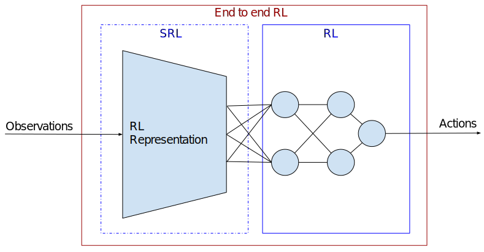

# S-RL Toolbox: Reinforcement Learning (RL) and State Representation Learning (SRL) Toolbox for Robotics

This repository was made to evaluate State Representation Learning methods using Reinforcement Learning. It integrates (automatic logging, plotting, saving, loading of trained agent) various RL algorithms (PPO, A2C, ARS, ACKTR, DDPG, DQN, ACER, CMA-ES, SAC, TRPO) along with different SRL methods (see [SRL Repo](https://github.com/araffin/srl-zoo)) in an efficient way (1 Million steps in 1 Hour with 8-core cpu and 1 Titan X GPU).

We also release customizable Gym environments for working with simulation (Kuka arm, Mobile Robot in PyBullet, running at 250 FPS on a 8-core machine) and real robots (Baxter Robot, Robobo with ROS).

Related paper:
- "S-RL Toolbox: Environments, Datasets and Evaluation Metrics for State Representation Learning" (Raffin et al., 2018) [https://arxiv.org/abs/1809.09369](https://arxiv.org/abs/1809.09369)

<a href="https://youtu.be/qNsHMkIsqJc"></a>

## Documentation

Documentation is available online: [https://s-rl-toolbox.readthedocs.io/](https://s-rl-toolbox.readthedocs.io/)


## Installation

**Python 3 is required** (python 2 is not supported because of OpenAI baselines)

Note: we are using [Stable Baselines](https://github.com/hill-a/stable-baselines.git), a fork of OpenAI Baselines with unified interface and other improvements (e.g. tensorboard support).


### Using Anaconda

0. Download the project (note the `--recursive` argument because we are using git submodules):
```
git clone git@github.com:araffin/robotics-rl-srl.git --recursive
```

1. Install the swig library:
```
sudo apt-get install swig
```

2. Install the dependencies using `environment.yml` file (for anaconda users) in the current environment
```
conda env create --file environment.yml
source activate py35
```

[PyBullet Documentation](https://docs.google.com/document/d/10sXEhzFRSnvFcl3XxNGhnD4N2SedqwdAvK3dsihxVUA)

### Using Docker

Please read the [documentation](https://s-rl-toolbox.readthedocs.io/) for more details.


## Reinforcement Learning

Several algorithms from [Stable Baselines](https://github.com/hill-a/stable-baselines) have been integrated along with some evolution strategies and SAC:

- A2C: A synchronous, deterministic variant of Asynchronous Advantage Actor Critic (A3C).
- ACER: Sample Efficient Actor-Critic with Experience Replay
- ACKTR: Actor Critic using Kronecker-Factored Trust Region
- ARS: Augmented Random Search (https://arxiv.org/abs/1803.07055)
- CMA-ES: Covariance Matrix Adaptation Evolution Strategy
- DDPG: Deep Deterministic Policy Gradients
- DeepQ: DQN and variants (Double, Dueling, prioritized experience replay)
- PPO1: Proximal Policy Optimization (MPI Implementation)
- PPO2: Proximal Policy Optimization (GPU Implementation)
- SAC: Soft Actor Critic
- TRPO: Trust Region Policy Optimization (MPI Implementation)

Please read the [documentation](https://s-rl-toolbox.readthedocs.io/) for more details on how to train/load an agent on discrete/continuous actions, and how to add your own rl algorithm.


### Hyperparameter Search

This repository also allows hyperparameter search, using [hyperband](https://arxiv.org/abs/1603.06560) or [hyperopt](https://papers.nips.cc/paper/4443-algorithms-for-hyper-parameter-optimization.pdf) for the implemented RL algorithms

for example, here is the command for a hyperband search on PPO2, ground truth on the mobile robot environment:
```bash
python -m rl_baselines.hyperparam_search --optimizer hyperband --algo ppo2 --env MobileRobotGymEnv-v0 --srl-model ground_truth
```

## Environments

All the environments we propose follow the OpenAI Gym interface. We also extended this interface (adding extra methods) to work with SRL methods (see [State Representation Learning Models](#state-representation-learning-models)).

### Available Environments

| **Kuka environment**       | **Mobile Robot environment**       | **Racing car environment**       |
| -------------------------- | ---------------------------------- | -------------------------------- |
|  |  |  |


| **Name**                          | **Action space (discrete)**                | **Action space (continuous)**                 | **Rewards**                                                                                                                                             | **ground truth**                                  |
| --------------------------------- | ------------------------------------------ | --------------------------------------------- | ------------------------------------------------------------------------------------------------------------------------------------------------------- | ------------------------------------------------- |
| **Kuka**<br>**Button**            | 6 actions (3D cardinal direction)          | 3 axis (3D cardinal direction) <sup>(1)</sup> | 1 when target reached, -1 when too far from target or when table is hit, otherwise 0 <sup>(2)</sup> <sup>(3)</sup>                                                    | the X,Y,Z position of the effector <sup>(4)</sup> |
| **Kuka**<br>**RandButton**        | 6 actions (3D cardinal direction)          | 3 axis (3D cardinal direction) <sup>(1)</sup> | 1 when target reached, -1 when too far from target or when table is hit, otherwise 0 <sup>(2)</sup> <sup>(3)</sup>                                                    | the X,Y,Z position of the effector <sup>(4)</sup> |
| **Kuka**<br>**2Button**           | 6 actions (3D cardinal direction)          | 3 axis (3D cardinal direction) <sup>(1)</sup> | 1 when the first target is reached, 1 when the second target is reached, -1 when too far from target or when table is hit, otherwise 0 <sup>(2)</sup> | the X,Y,Z position of the effector <sup>(4)</sup> |
| **Kuka**<br>**MovingButton**      | 6 actions (3D cardinal direction)          | 3 axis (3D cardinal direction) <sup>(1)</sup> | 1 when target reached, -1 when too far from target or when table is hit, otherwise 0 <sup>(2)</sup> <sup>(3)</sup>                                                    | the X,Y,Z position of the effector <sup>(4)</sup> |
| **MobileRobot**<br>               | 4 actions (2D cardinal direction)          | 2 axis (2D cardinal direction)                | 1 when target reached, -1 for a wall hit, otherwise 0 <sup>(2)</sup>                                                                                    | the X,Y position of the robot <sup>(4)</sup>      |
| **MobileRobot**<br>**2Target**    | 4 actions (2D cardinal direction)          | 2 axis (2D cardinal direction)                | 1 when target reached, -1 for a wall hit, otherwise 0 <sup>(2)</sup>                                                                                    | the X,Y position of the robot <sup>(4)</sup>      |
| **MobileRobot**<br>**1D**         | 2 actions (1D cardinal direction)          | 1 axis (1D cardinal direction)                | 1 when target reached, -1 for a wall hit, otherwise 0 <sup>(2)</sup>                                                                                    | the X position of the robot <sup>(4)</sup>        |
| **MobileRobot**<br>**LineTarget** | 4 actions (2D cardinal direction)          | 2 axis (2D cardinal direction)                | 1 when target reached, -1 for a wall hit, otherwise 0 <sup>(2)</sup>                                                                                    | the X,Y position of the robot <sup>(4)</sup>      |
| **CarRacing**                     | 4 actions (left, right, accelerate, brake) | 3 axis (stearing, accelerate, brake)          | -100 when out of bounds, otherwise -0.1                                                                                                                 | the X,Y position of the car <sup>(4)</sup>        |

<sub><sup>1. The action space can use 6 axis arm joints control with the `--joints` flag</sup></sub><br>
<sup><sup>2. The reward can be the euclidian distance to the target with the `--shape-reward` flag</sup></sup><br>
<sup><sup>3. When using `--shape-reward` and ```--continuous```, the reward for hitting the button is 50 and for being out of bounds is -250. This is to prevent the agent hitting the table to stop the environment early and obtaining a higher reward</sup></sup><br>
<sup><sup>4. The ground truth can be relative position from agent to the target by changing the `RELATIVE_POS` constant in the environment file</sup></sup>


the available environments are:
- Kuka arm: Here we have a Kuka arm which must reach a target, here a button.
    - KukaButtonGymEnv-v0: Kuka arm with a single button in front.
    - KukaRandButtonGymEnv-v0: Kuka arm with a single button in front, and some randomly positioned objects
    - Kuka2ButtonGymEnv-v0: Kuka arm with 2 buttons next to each others, they must be pressed in the correct order (lighter button, then darker button).
    - KukaMovingButtonGymEnv-v0: Kuka arm with a single button in front, slowly moving left to right.
- Mobile robot: Here we have a mobile robot which reach a target position
    - MobileRobotGymEnv-v0: A mobile robot on a 2d terrain where it needs to reach a target position.
    - MobileRobot2TargetGymEnv-v0: A mobile robot on a 2d terrain where it needs to reach two target positions, in the correct order (lighter target, then darker target).
    - MobileRobot1DGymEnv-v0: A mobile robot on a 1d slider where it can only go up and down, it must reach a target position.
    - MobileRobotLineTargetGymEnv-v0: A mobile robot on a 2d terrain where it needs to reach a colored band going across the terrain.
- Racing car: Here we have the interface for the Gym racing car environment. It must complete a racing course in the least time possible (only available in a terminal with X running)
    - CarRacingGymEnv-v0: A racing car on a racing course, it must complete the racing course in the least time possible.
- Baxter: A baxter robot that must reach a target, with its arms. (see [Working With Real Robots: Baxter and Robobo](#working-with-real-robots-baxter-and-robobo))
    - Baxter-v0: A bridge to use a baxter robot with ROS (in simulation, it uses Gazebo)
- Robobo: A Robobo robot that must reach a target position.
    - RoboboGymEnv-v0: A bridge to use a Robobo robot with ROS.

Please read the [documentation](https://s-rl-toolbox.readthedocs.io/) for more details (e.g. adding a custom environment).


## State Representation Learning Models

Please look the [SRL Repo](https://github.com/araffin/srl-zoo) to learn how to train a state representation model.
Then you must edit `config/srl_models.yaml` and set the right path to use the learned state representations.

The available state representation models are:
- ground_truth: the arm's x,y,z position
- robotic_priors: Robotic Priors model
- supervised: a supervised model from the raw pixels to the arm's x,y,z position
- pca: pca applied to the raw pixels
- autoencoder: an autoencoder from the raw pixels
- vae: a variational autoencoder from the raw pixels
- inverse: an inverse dynamics model
- forward: a forward dynamics model
- srl_combination: a model combining several losses (e.g. vae + forward + inverse...) for SRL
- multi_view_srl: a SRL model using views from multiple cameras as input, with any of the above losses (e.g triplet and others)
- joints: the arm's joints angles
- joints_position: the arm's x,y,z position and joints angles

Please read the [documentation](https://s-rl-toolbox.readthedocs.io/) for more details (e.g. adding a custom SRL model).


## Troubleshooting
If a submodule is not downloaded:
```
git submodule update --init
```
If you have troubles installing mpi4py, make sure you the following installed:
```
sudo apt-get install libopenmpi-dev openmpi-bin openmpi-doc
```

## Known issues

The inverse kinematics function has trouble finding a solution when the arm is fully straight and the arm must bend to reach the requested point.
